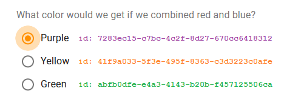
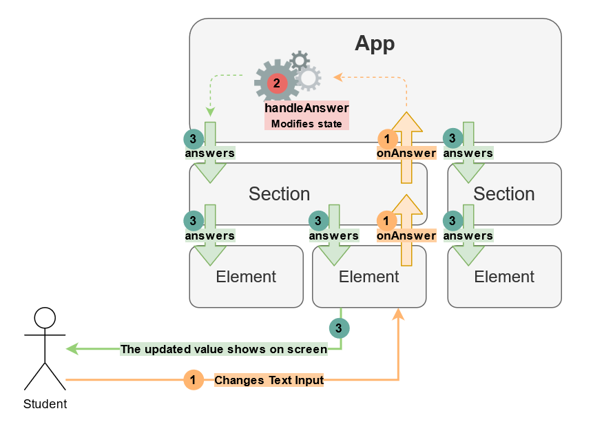

Activities contain questions which can be filled by the student.
These current interactable elements are:

Name | Description
--- | ---
`text-input` | Open text question (Text field)
`multi-choice` | Multiple choice question (Radio buttons)
`number-input` | Numeric question

## The `answers` State

The `answers` state is located in the App component.

It stores the answer to every question in the activity.
It doesn't care where each question is, nor what section it's on.

This state variable updates every time the student updates the value to a question. More on that in [OnAnswer Events](#onanswer-callbacks).

It's built like a dictionary, where each key represents the ID of the question element, and the value is the answer.


```jsx title="The 'structure' Prop of This Element"
{
  type: "text-input",
  id: "ab1a1e70-79d6-11eb-b60b-e922102d5715",
  text: "What color would we get if we combined red and blue?"
}
```

```jsx title="The 'answers' State (Located in the App Component)"
{ "ab1a1e70-79d6-11eb-b60b-e922102d5715": "Purple" }
```

Look how the ID of the question matches the key in the state dictionary.

It's worth noting that `multi-choice` questions work very similarly, but they store the selected option's ID
instead of its text. This is done to avoid ambiguity between similar options.



```jsx
{ "ab1a1e70-79d6-11eb-b60b-e922102d5715": "7283ec15-c7bc-4c2f-8d27-670cc6418312" }
```

The ID of the option we selected matches the answer shown in `answers`.

## `onAnswer` Callbacks

How does the `App` component, sitting at the top of the hierarchy, know when to change the `answers` state?
How can it know that the student has just typed something in a random element?

In React, to take care of events in components down in the tree, we use callback functions, and components need to
pass them down to their sub-components.

First, we define a function to handle the event of "changing an answer" in `App.jsx`:

```jsx title="App.jsx"
const handleAnswer = (elementId, answer) => {
  setAnswers(produce(answers, (newAnswers) => {
    newAnswers[elementId] = answer;
  }));
};
```

Notice that the function has two arguments:

Argument | Description
--- | ---
`elementId` | The ID of the element that was updated, so we know which ID to update in `answers`.
`answer` | The new, updated answer from that element.

When we call this function, doesn't matter from where, we will need to specify these two arguments.

For now, the function just updates the `answers` state [using Immer](react#mutating-state-with-immer).

When rendering the sections, the App component also gives each section this handle function:

```jsx title="App.jsx" {5}
{structure.sections.map((section) => (
  <Section
    structure={section}
    ...
    onAnswer={handleAnswer}
    ...
  />
))}
```

The section gets it as one of its props:

```jsx title="Section.jsx"
function Section({ structure, ... onAnswer, ... }) {
  // ...
}
```

And passes it down to the elements in the render:

```jsx title="Section.jsx" {5}
{structure.elements.map((element) => (
  <GenericElement
    structure={element}
    ...
    onAnswer={handleAnswer}
    ...
  />
))}
```

Inside `GenericElement.jsx`, we specify that first argument (the element ID), because it's the same for every element type.
Then we continue to pass the function (which now has only one argument).

```jsx title="GenericElement.jsx"
function GenericElement({ structure, ..., onAnswer, ... }) {
  // An answer event we get from the element and pass it up to the section.
  // Here we add the id of the element, so the section knows which question is answered.
  const handleAnswer = (a) => {
    onAnswer(structure.id, a);
  };

  let elementToRender;
  switch (structure.type) {
    ...
    case 'text-input':
      elementToRender = <ElementTextInput structure={structure} onAnswer={handleAnswer} />;
      break;
    ...
  }

  return (
    <div id={structure.id}>
      {elementToRender}
    </div>
  );
}
```

Which pass it on, until we get to the end destination.
For example, `ElementTextInput.jsx` (simplified code):

```jsx title="ElementTextInput.jsx"
function ElementTextInput({ structure, ..., onAnswer, ... }) {
  const handleChange = (event) => {
    onAnswer(event.target.value);
  };

  return (
    <FormControl>
      <RichLabel>{structure.text}</RichLabel>
      <TextField onChange={handleChange} />
    </FormControl>
  );
}
```

As you can see, we're calling `onAnswer` when the student changes their selection in the radio group (multi-choice options).

So let's say the user has just typed the last letter in his answer: **"Purple"**.

This triggers `handleChange` which calls `onAnswer` (that was given by `GenericElement.jsx`) with the argument "Purple".

Inside GenericElement, it takes the "Purple" argument and calls `onAnswer` with the ID of the element and "Purple".

From there the function call goes up until it reaches `App.jsx`, where `handleAnswer` is called,
the state is updated, and our activity lives happily ever after.

## Passing Down Answers as Props

The form data (the answers) is managed by React.
This means that the state should be represented in every input's value in renders.
[More info](https://reactjs.org/docs/forms.html#controlled-components)

What this actually means is that we will have to pass the answers to the elements and display them in every input:

```jsx
<input type="text" value={answer} />
```



Why do we let React manage the input states instead of just reading the inputs' values?

1. We want to make sure there is one reliable source of truth (*our* state), to which every component is subject.
2. We will later want to [load pre-saved answers from the local storage or from a saved file.](activity-saving-progress)

All we have to do is simply pass the answers prop to the elements.

```jsx title="App.jsx" {4}
{structure.sections.map((section) => (
  <Section
    structure={section}
    answers={answers}
    ...
    onAnswer={handleAnswer}
    id={section.id}
    key={section.id}
  />
))}
```

```jsx title="Section.jsx" {5}
{structure.elements.map((element) => (
  <GenericElement
    structure={element}
    ...
    answer={answers[element.id] || undefined}
    onAnswer={handleAnswer}
    key={element.id}
  />
))}
```

```jsx title="ElementTextInput.jsx" {3}
<TextField
  onChange={handleChange}
  defaultValue={answer}
  ...
/>
```
