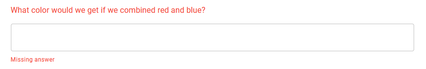
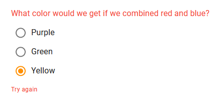
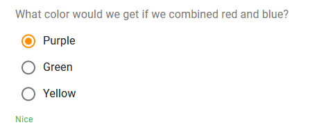

## Checking Procedures

There are two ways to check questions:

**1. Using the CHECK ANSWERS Button**

import Button from '@material-ui/core/Button';

<Button
  variant="contained"
  color="primary"
>
  <b>
    Check Answers
  </b>
</Button>
<br />
<br />

This button appears at the end of every section, and it checks only the section that it's in.

It's rendered from the Section component, inside a form element.

As you can see, this is a submit button inside a form. When it's pressed, the form goes to its `onSubmit` function,
which is the Section's `onCheck` prop. This is of course a callback function which is being handled by `App.jsx`.

Inside App's render:

```jsx title="App.jsx" {6}
<Section
  structure={section}
  answers={answers}
  ...
  onAnswer={handleAnswer}
  onCheck={handleCheckSection}
  id={section.id}
  key={section.id}
/>
```

The handle function:

```jsx title="App.jsx"
const handleCheckSection = (sectionId) => {
  const sectionStructure = structure.sections.find((s) => s.id === sectionId);
  updateElementsFeedback(checkSection(sectionStructure, answers));
};
```

The function `checkSection` is defined in an external file, under `hapi-activity/src/checking.js`.

We will talk about the file and about `updateElementsFeedback` later.

**2. Using the CHECK ALL Button**

import CheckAllButton from '../src/components/CheckAllButton';

<CheckAllButton />

This button appears at the end of the activity and triggers the following function:

```jsx title="App.jsx"
const handleSubmitActivity = () => {
  const activityAnswerStatus = checkActivity(structure, answers);
  activityAnswerStatus.sectionStatuses.forEach((sectionAnswerStatus) => {
    updateElementsFeedback(sectionAnswerStatus);
  });
  if (activityAnswerStatus.activityComplete) {
    dropConfetti();
    setShowSuccess(true); // Display the "Activity complete" green snackbar
  } else {
    document
      .getElementById(activityAnswerStatus.firstIncompleteElementId)
      .scrollIntoView({ behavior: 'smooth', block: 'center' });
  }
};
```

Here we call the function `checkActivity` which is also defined in `checking.js`.

Then we update the element feedback props (more on those later),
and we drop confetti if the activity is complete,
and if it's not, we will automatically scroll to the first problematic question.

## `checking.js`

This file contains three functions:

Name | Description | Returns
--- | --- | ---
`checkElement` | Checks a single, given element's answer to see if it's missing or incorrect | An [**Element Answer Status**](#element-answer-status) object
`checkSection` | Checks the given section's elements using `checkElement` | A [**Section Answer Status**](#section-answer-status) object
`checkActivity` | Checks the whole activity's sections and elements using `checkSection` | An [**Activity Answer Status**](#activity-answer-status) object

The answer status objects are built like this:

### Element Answer Status

```js
{ elementId, fillable, answerFilled, hasCorrectAnswer, answerCorrect, elementComplete }
```

Property | Type | Description
--- | --- | ---
`elementId` | `String` | The ID of the element in question
`fillable` | `Boolean` | Whether this element can be filled or answered
`answerFilled` | `Boolean` | Whether the student has entered some answer in the question
`hasCorrectAnswer` | `Boolean` | Whether the question has a correct answer to check (Does it have a `correct` prop or any other criteria for what defines a correct answer?)
`answerCorrect` | `Boolean` | Whether the answer to the element is correct
`elementComplete` | `Boolean` | True if the student has done everything that this element requires. If it's fillable, is it filled? And if it has a correct answer, is it correct? If the element is not fillable nor has a correct answer, this will be true (as if the student just had to read the element's content. That's why an activity with no fillable elements will always be considered to be 'complete').

### Section Answer Status

```js
{ sectionId, elementStatuses, sectionComplete, firstIncompleteElementId }
```

Property | Type | Description
--- | --- | ---
`sectionId` | `String` | The id of the section in question
`elementStatuses` | `Array<ElementAnswerStatus>` | The statuses of the section's elements
`sectionComplete` | `Boolean` | Whether all elements have passed the checks
`firstIncompleteElementId` | `String` | The ID of the first element with problems

### Activity Answer Status

```js
{ sectionStatuses, activityComplete, firstIncompleteElementId }
```

Property | Type | Description
--- | --- | ---
`sectionStatuses` | `Array<SectionAnswerStatus>` | The statuses of the activity's sections
`activityComplete` | `Boolean` | Whether all elements and sections have passed the checks
`firstIncompleteElementId` | `String` | The ID of the first element with problems

## Automatically Checking Questions

We can let the code automatically check the `multi-choice` and the `number-input` questions,
because we can provide them criteria for a correct answer.

However, open text questions (text-input) are much more tricky, and they require humans to check them.
So we don't check those, but just verify that they are not empty.

Question Type | When Empty | When filled incorrectly | When filled correctly
--- | --- | --- | ---
Text | ⭕ Will show as missing | ✔ Will show as complete | ✔ Will show as complete
Number | ⭕ Will show as missing | ❌ Will show as incorrect | ✔ Will show as complete
Multi Choice | ⭕ Will show as missing | ❌ Will show as incorrect | ✔ Will show as complete

What is written in this part ("Automatically Checking Questions") is roughly what happens inside the function `checkElement`,
inside `checking.js`.

### Checking `text-input` Elements

Because we can't check if an answer is correct, we simply mark the element as complete just if it has something
filled into it. Else it's declared as "Missing answer".

### Checking `number-input` Elements

Number inputs have a range of numbers which they consider to be the correct answer.
This is to consider tiny calculation margins and other floating-point mistakes which may happen during calculations.

Also, this gives teachers the ability to specify a wanted range of correct answers.

If only one number should be correct, the min and the max values will be the same.

The range is specified in the element's structure:

```js
{
  type: 'number-input',
  text: 'What is the calculation result?',
  min: 4.20,
  max: 4.30,
}
```

The answer to this question is correct if the number falls between `4.2` and `4.3`.

```js
{
  type: 'number-input',
  text: 'What is the calculation result?',
  min: 3.14,
  max: 3.14,
}
```

The answer to this question is only correct if the number is equal to `3.14`.

### Checking `muli-choice` Elements

Multiple choice questions have options, and each option has a textual answer and an ID.

We save the option's ID as the answer to the question.

The correct option's ID is specified in the `correct` property of the element's structure.

```js
{
  type: 'multi-choice',
  options: [...],
  correct: [ '260cb368-aaf6-487d-bc2f-f9628def8489' ],
}
```

## Elements' Feedback

After checking questions, the activity needs to tell the student about his performance in every question.

#### Missing Answer Feedback



#### Incorrect Answer Feedback



#### Correct Answer Feedback



### The `elementsFeedback` State

The `elementsFeedback` state is defined and managed in the `App` component.

It is a dictionary where the keys represent the IDs of elements, and their values are objects whose properties are:

Property | Type | Description
--- | --- | ---
`helperText` | `String` | What to write in the helper text. The helper text is that small label: "Missing answer", "Try again", etc.
`showHelperText` | `Boolean` | Whether to show the helperText
`error` | `Boolean` | Whether to paint the question title and helperText in red

For example:

```js
initialElementsFeedback = {
  'df3c183d-7194-4c11-a79a-d46d8c947940': {
    helperText: ' ',
    showHelperText: false,
    error: false,
  },
  '746852c4-fe42-455c-967f-c71d207dfeac' : {
    helperText: 'Well done!',
    showHelperText: true,
    error: false,
  },
  'b1be27b6-4cac-4f68-9b48-8816a166389b': {
    helperText: 'Missing answer',
    showHelperText: true,
    error: true,
  },
};
```

:::note
Note that these element feedback values are only relevant for fillable elements. We won't put them on visual elements
like images because they don't have any way of answering them.
:::

### Passing down this state

We pass this state down to every section, and in the sections we give every element its feedback value.

### `updateElementsFeedback`

You may have seen that we were using this function earlier, in the checking functions inside `App.jsx`.

This function takes a [Section Answer Status](#section-answer-status) object and updates the App's `elementsFeedback` state accordingly.

It also generates a random phrase for `helperText`, based on whether the answer is correct or not.
