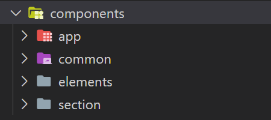

Let's take a look at the components folder under `hapi-activity/src`:

Name | Description
--- | ---
`app/` | The `App` component and other small components that it (and only it) uses.
`common/` | Shared components that many other components throughout the package use.
`elements/` | All the implementations to element types (like label, image, etc.).
`section/` | The `Section` component and other small components that it (and only it) uses.
