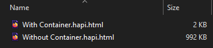

When saving activities to the computer, it's important to not take a lot of space.
If we saved every activity as a full, self-contained HTML file (containing also the whole source code), we would end up
with a file as large as 1 MB.

There's no need to re-save every time the same activity code, so instead, we use **activity container files**.



Instead of including all the JavaScript code to run the application, a container is just an iframe to an empty activity,
located at [hapi-activity.netlify.app](https://hapi-activity-netlify.app).
If you visited the site you would see nothing, because it's an empty activity.

:::info
An iframe is an HTML tag that displays another HTML document inside it.
[More info at w3schools.com](https://www.w3schools.com/tags/tag_iframe.asp)
:::

The container iframe displays an empty activity at hapi-activity.netlify.app, and then communicates to it
the activity's structure and saved answers.

The communication between the iframe and the container is done using [cross-window communication](https://javascript.info/cross-window-communication),
with the `postMessage` and the `message` event.

This is what a container looks like:

```html title="Activity Container Example" {19-25}
<!DOCTYPE html>
<html>
  <head>
    <title>Activity Title</title>
    <style>
      ...
    </style>
  </head>
  <body>
    <iframe
      src="https://hapi-activity.netlify.app/"
      id="container"
    ></iframe>
    <script type="text/javascript">
      var container = document.getElementById('container');
      container.onload = function() {
        container.contentWindow.postMessage({
          message: 'getContent', value: {
            structure: {
              mainHeader: 'Activity Title',
              sections: [ ... ]
            },
            answers: {
              '40f49880-c475-4fb0-a556-4d804330a1a8': '746ec994-e895-4473-913a-4eccb890a7d1'
            }
          }
        }, '*');
      };
    </script>
  </body>
</html>
```

This is exactly how activity files look when they are saved on a computer.
The only part that changes between activities is in the marked lines.

This `postMessage` function needs to be received at the activity side (at https://hapi-activity.netlify.app/).
The code to handle this is at `hapi-activity/src/index.js`:

```jsx title="index.js" {5-12}
function main() {
  let structure = {};
  let answers;
  if (window.self !== window.top) {
    // If we're inside an iFrame, we need to wait to receive the content from the upper frame.
    window.addEventListener('message', (event) => {
      const { message, value } = event.data;
      if (message === 'getContent') {
        structure = value.structure;
        answers = value.answers;
      }
    }, false);
  } else if (process.env.NODE_ENV && process.env.NODE_ENV === 'development') {
    // If inside development environment, use the development structure from local storage
    const localStorageStructure = localStorage.getItem('devmode-structure');
    try {
      structure = JSON.parse(localStorageStructure);
    } catch {
      alert('There was a problem parsing the current devmode structure');
    }
    if (!Object.entries(structure).length) {
      structure = DEVMODE_DEFAULT_STRUCTURE;
      localStorage.setItem('devmode-structure', JSON.stringify(structure));
    }
  }
  renderApp(structure, answers);
}

main();
```

(`index.js` is the entry point in every package. When the package is run, this is the file being run.
In React projects, we use the `index.js` file to perform `ReactDOM.render` functions, which in this case are in the
`renderApp` function which is defined later.)


