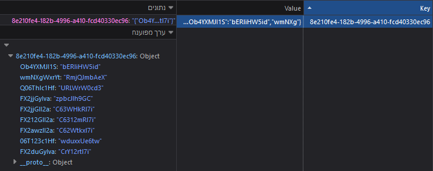

There are two ways that the activity can save progress:

* Auto-saving into local storage
* Downloading a file

## Auto-Saving

After every update to the `answers` state in the App (More about it here), the answers are automatically saved
to the local storage:

```jsx title="App.jsx"
useEffect(() => {
  // `useEffect` listens for when the `answers` prop changes and calls this line
  localStorage.setItem(structure.serialNumber, JSON.stringify(answers));
}, [answers]);
```

As the comment suggests, this block (inside `useEffect`) is being called after the `answers` state is changed.
`useEffect` is given to us by React and it gives us events that fire when certain states change.
In this case, we specified `[answers]` as the second argument, so it listens for any change in the answers.

We save the answers to the localStorage registry associated with the id of the activity (the serial number).

This is what the local storage looks like:



As you can see, the activity with that ID is saved in the local storage.
In this way, multiple activities' progress can be saved in the local storage.

## File Saving

The student can willingly download a save file. More about it in [activity creation](creator-activity-creation).
