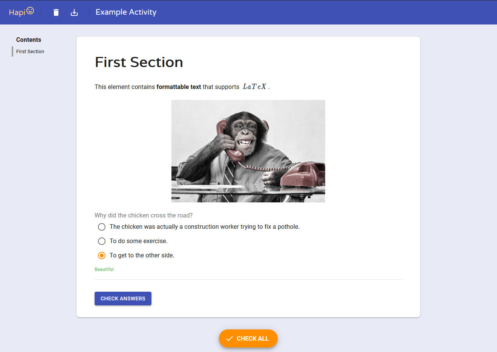
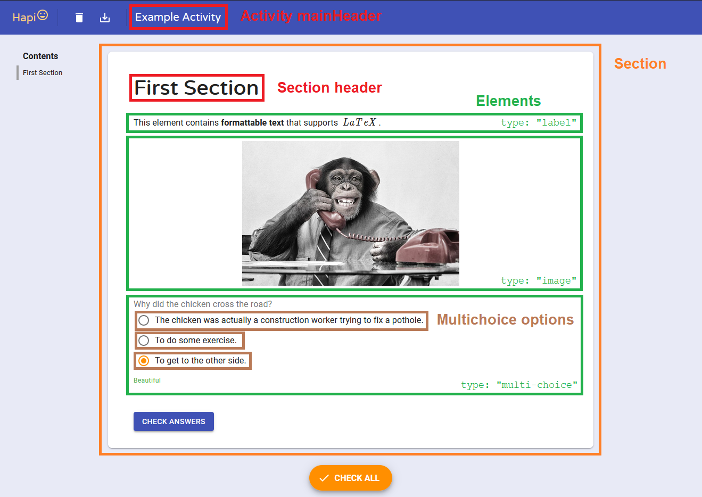

## The Structure

The activity structure is a JavaScript object describing the structure of the activity. Surprising!

Here's an example of an activity and its structure object:





import Tabs from '@theme/Tabs';
import TabItem from '@theme/TabItem';
import ReactJson from 'react-json-view';
import ThemeContextConsumer from '../src/components/ThemeContextConsumer';

<Tabs
  defaultValue="tree"
  values={[
    { label: 'JavaScript Object', value: 'raw' },
    { label: 'Interactive Tree', value: 'tree' },
  ]}
>
  <TabItem value="raw">

    ```js
    {
      mainHeader: "Example Activity",
      language: "en",
      id: "dde1ad60-69f9-11eb-837c-93c9df913391",
      sections: [
    {
      header: "First Section",
      id: "3b821cb0-745f-11eb-9455-5fc5d8dcc5e7",
      elements: [
    {
      type: "label",
      id: "3ff1d2e0-745f-11eb-9455-5fc5d8dcc5e7",
      text: "This element contains **formattable text** that supports $ LaTeX $.",
    },
    {
      type: "image",
      id: "6657b030-745f-11eb-9455-5fc5d8dcc5e7",
      src: "https://assets.bwbx.io/images/users/iqjWHBFdfxIU/icMTqxFzFeVY/v1/1000x-1.jpg",
    },
    {
      type: "multi-choice",
      id: "928580b0-745f-11eb-9455-5fc5d8dcc5e7",
      options: [
    {
      text: "The chicken was actually a construction worker trying to fix a pothole.",
      id: "bda78680-745f-11eb-9455-5fc5d8dcc5e7",
    },
    {
      text: "To do some exercise.",
      id: "31081db0-7460-11eb-97e0-2b4499bf2b66",
    },
    {
      text: "To get to the other side.",
      id: "cef6d490-745f-11eb-9455-5fc5d8dcc5e7",
    },
      ],
      text: "Why did the chicken cross the road?",
      correct: [
      "cef6d490-745f-11eb-9455-5fc5d8dcc5e7",
      ],
      dontShuffle: true,
    },
      ],
    },
      ],
    }
    ```

  </TabItem>
  <TabItem value="tree">
    <ThemeContextConsumer>
      {({ isDarkTheme }) => (
        <ReactJson
          name="structure"
          theme={isDarkTheme ? 'bright' : 'bright:inverted'}
          style={{ backgroundColor: 'transparent', fontFamily: 'var(--ifm-font-family-monospace)'}}
          collapsed={4}
          enableClipboard={false}
          displayObjectSize={false}
          displayDataTypes={false}
          src={
            {
              mainHeader: "Example Activity",
              language: "en",
              id: "dde1ad60-69f9-11eb-837c-93c9df913391",
              sections: [
                {
                  header: "First Section",
                  id: "3b821cb0-745f-11eb-9455-5fc5d8dcc5e7",
                  elements: [
                    {
                      type: "label",
                      id: "3ff1d2e0-745f-11eb-9455-5fc5d8dcc5e7",
                      text: "This element contains **formattable text** that supports $ LaTeX $.",
                    },
                    {
                      type: "image",
                      id: "6657b030-745f-11eb-9455-5fc5d8dcc5e7",
                      src: "https://assets.bwbx.io/images/users/iqjWHBFdfxIU/icMTqxFzFeVY/v1/1000x-1.jpg",
                    },
                    {
                      type: "multi-choice",
                      id: "928580b0-745f-11eb-9455-5fc5d8dcc5e7",
                      options: [
                        {
                          text: "The chicken was actually a construction worker trying to fix a pothole.",
                          id: "bda78680-745f-11eb-9455-5fc5d8dcc5e7",
                        },
                        {
                          text: "To do some exercise.",
                          id: "31081db0-7460-11eb-97e0-2b4499bf2b66",
                        },
                        {
                          text: "To get to the other side.",
                          id: "cef6d490-745f-11eb-9455-5fc5d8dcc5e7",
                        },
                      ],
                      text: "Why did the chicken cross the road?",
                      correct: [
                        "cef6d490-745f-11eb-9455-5fc5d8dcc5e7",
                      ],
                      dontShuffle: true,
                    },
                  ],
                },
              ],
            }
          }
        />
      )}
    </ThemeContextConsumer>
  </TabItem>
</Tabs>

At the root of the structure we describe the activity's properties, such as its name, its supported language,
its id, and the sections it contains.

Each section, similarly, has a name, an id, and the elements it contains.

And finally, each element describes its type, its id and its other relevant properties.

## How the structure is passed down to sections

Let's look at the main component of the activity: `App`.
It's located under `hapi-activity/src/components/app/App.jsx`.

Let's then scroll down to the rendering section (the `return` statement):

```jsx {10,16,18,20,25,26}
function App({ structure, savedAnswers }) {
  // ...
  return (
    <ThemeProvider theme={theme}>
      <RTL active={rtl}>
        <CssBaseline />
        <div id="back-to-top-anchor" />
        <TopBar
          elevation={topBarElevation}
          mainHeader={structure.mainHeader}
          onDownload={handleSaveActivity}
          onReset={handleResetActivity}
        />
        {/* This empty toolbar provides spacing at the top */}
        <Toolbar />
        <TableOfContents structure={structure} />
        <Container maxWidth="md" className={classes.container}>
          {structure.sections.map((section) => (
            <Section
              structure={section}
              answers={answers}
              elementsFeedback={elementsFeedback}
              onAnswer={handleAnswer}
              onCheck={handleCheckSection}
              id={section.id}
              key={section.id}
            />
          ))}
          {fillableElements.length && <CheckAllButton onClick={handleSubmitActivity} />}
          <SuccessSnackbar
            open={showSuccess}
            onClose={handleSuccessSnackbarClose}
            rtl={rtl}
          />
        </Container>
        <ScrollToTopButton />
      </RTL>
      <p className={classes.version}>{version}</p>
    </ThemeProvider>
  );
}
```

:::info
A full render explanation for the App component is [right here](activity-full-renders#app).
:::

As you can see, we're using the structure prop of the activity App to pass data to other components that App creates.

* `TopBar` contains the activity's main header.
* `TableOfContents` contains the names of the sections of the activity, and it needs their ids for scrolling features.
* After that we loop over the sections in `structure`, and we give each section its own structure.
* We're using the `key` prop for React, to keep the identity of components generated off a list.

We pass the section structure to the `Section` component with the prop name `structure`.
When we pass the section structure to the `Section` component, it treats it as its own structure.

This is the section's render:

```jsx {5,7,9,13}
function Section({ structure, /* other props */ }) {
  // ...
  return (
    <Paper id={id} className={classes.sectionPaper}>
      <SectionHeader>{structure.header}</SectionHeader>
      <form onSubmit={handleSubmit} className="section-elements">
        {structure.elements.map((element) => (
          <GenericElement
            structure={element}
            feedback={elementsFeedback[element.id] || undefined}
            answer={answers[element.id] || undefined}
            onAnswer={handleAnswer}
            key={element.id}
          />
        ))}
        {checkablesAmount > 0 && (
          <Button
            type="submit"
            variant="contained"
            color="primary"
            className={classes.button}
          >
            {strings.actionCheckAnswer}
          </Button>
        )}
      </form>
    </Paper>
  );
}
```

This structure, inside `Section`, is the **section's structure, not the whole activity structure**.
That's why when we do `structure.header` it gives us the header of that specific section.

:::note
In every component that has a structure prop (like `App`, `Section`, `GenericElement` and the other element components),
the structure prop resembles the component structure for each component, not the whole activity structure (except for `App` of course).

That means that in `Section`, the structure prop resembles the **section's structure**, and in `Element` the structure prop
resembles the **element's structure**.
:::

The `GenericElement` component is responsible for classifying the type of the element (specified in its `structure.type`),
and rendering the corresponding element for each type.

Let's take a look at the main part of its code:

```jsx
function GenericElement({ structure, /* Other props... */ }) {
  let elementToRender;
  switch (structure.type) {
    case 'label':
      elementToRender = <ElementLabel structure={structure} />;
      break;
    case 'image':
      elementToRender = <ElementImage structure={structure} />;
      break;
    case 'docs':
      elementToRender = <ElementDocs structure={structure} />;
      break;
    case 'youtube':
      elementToRender = <ElementYoutube structure={structure} />;
      break;
    // And more element types...
  }

  return (
    <div id={structure.id}>
      {elementToRender}
    </div>
  );
}
```

Again, the `structure` prop here is the structure of the element only. Not the section's nor the activity's.
That's why we can do `structure.id` peacefully, knowing that the id is this element's id.
`structure.type` is the element type (label, image, etc.).

So this is how the majority of components are rendered: Structure is passed down from the App to the Sections,
and from there to the Elements. Each component treats the structure given to it as its own structure, not
the global activity structure.
