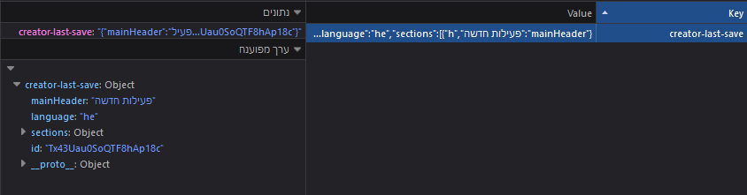

In addition to saving via files or exporting, the creator saves the current activity the author is working on
using `localStorage`, very similarly to the activity's automatic progress saving.

The creator is different from the activity in one way in this aspect - in the activity the student can
save multiple activities at once in the local storage, but in the creator only one activity at a time.

This is done to encourage saving via a file, because implementing a saving system with multiple files
might be confusing for the activity author.

The local storage is just a safety mechanism for when the computer suddenly crashes or the data is lost
in any other way.

## The Automatic Saving Procedure

The creator saves an activity to the local storage in two cases:

* Right before the user closes the window
* Every minute

There might be cases when the browser / computer crashes, so that's why we also save every minute.

Saving looks a lot like in the activity:

```jsx title="App.jsx"
const saveToLocalStorage = () => {
  localStorage.setItem('creator-last-save', JSON.stringify(structure));
};

useEffect(() => {
  // This is called only once when the component finishes loading
  window.onbeforeunload = () => {
    // This is called when the window is about to be closed
    saveToLocalStorage();
    return true;
  };
  const interval = setInterval(() => { saveToLocalStorage(); }, 60 * 1000);
  return () => {
    // This is called when the component is about to be unmounted (right before closing)
    clearInterval(interval);
  };
}, []);
```


