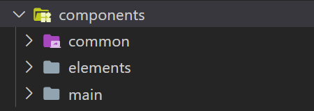

The `components` folder is located under `hapi-creator/src/`, and it's structured like this:

Name | Description
--- | ---
`common/` | Shared components that many other components throughout the package use.
`elements/` | All the implementations to element types (like label, image, etc.).
`main/` | Main components of the creator, such as the section, a generic element, and the menu at the side.
