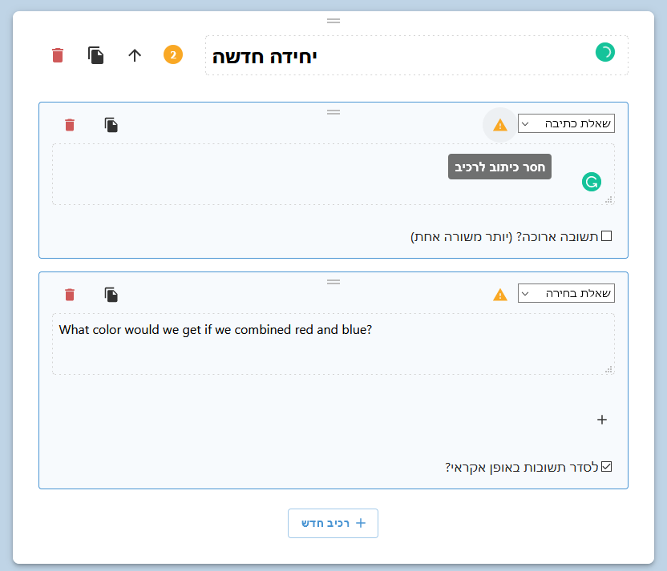
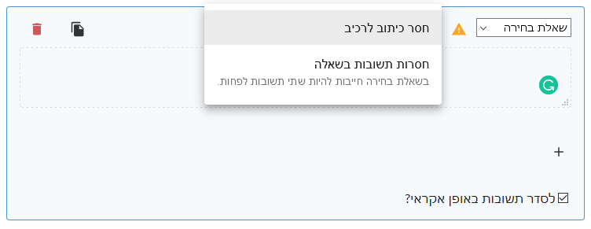
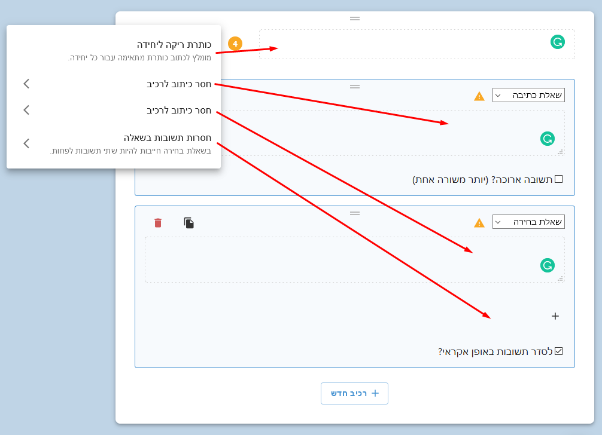

Notices (how they're named in the code), or warnings (how they're named in the UI)
are small messages that help the user identify mistakes in the creation of an activity,
and spot problems before exporting it.



The information about these notices in each render is located in the App component, as a state named `noticeObjects`.
This is an array of object with the custom type `noticeObject`.

## `notice` & `noticeObject`

`notice` is, quite surprisingly, an object describing a notice.
It's structured like this:

```jsx
{
  title: 'חסרות תשובות בשאלה',
  description: 'בשאלת בחירה חייבות להיות שתי תשובות לפחות.',
}
```

Which produces the result:


Each element or section can have none, one, or many of these notices.
In order to pass multiple notices to an element / section, we created the `noticeObject` object,
which looks like this:

```jsx
{
  id: 'c57c9e03-356d-4b60-92a7-a78f9ebe9d69',
  notices: [
    {
      title: 'חסרות תשובות בשאלה',
      description: 'בשאלת בחירה חייבות להיות שתי תשובות לפחות.',
    },
  ],
}
```

As you can see, `noticeObject` portrays every element or section with their id and the notices that they display.
In this way, elements and sections can have more than one notice.



## The `noticeObjects` State

So - the `noticeObjects` state is an array containing all the notice objects in the app, regardless of
whether each `noticeObject` represents a section or an element.
It doesn't care about these things, just about ids and notices.

This notice objects state is passed down the component tree just like the structure. For example:

```jsx title="App.jsx" {6}
{structure.sections.map((section, index) => (
  <Section
    key={section.id}
    index={index}
    structure={section}
    noticeObjects={noticeObjects}
    onUpdate={handleUpdateSection}
    onDuplicate={handleDuplicateSection}
    onDelete={handleDeleteSection}
  />
))}
```

## Displaying `noticeObjects` in Sections

Sections are different from elements in one thing when talking about notices -
they need to show their notices, and also their child elements' notices.
This greatly helps the user in spotting problems.



This means that every section that receives a `noticeObjects` prop, must understand which notice object belongs
to itself, and which notice objects belong to its elements, and display all of their notices too.

```jsx title="Section.jsx"
function Section({ index, structure, noticeObjects, onUpdate, onDuplicate, onDelete }) {
  ...
  // Notice object of this section
  const sectionNoticeObject = noticeObjects.find(({ id }) => id === structure.id);
  // Notice objects of elements that belong to this section
  const elementsNoticeObjects = noticeObjects.filter(({ id }) => (
    structure.elements.find((element) => id === element.id)
  ));
  ...
  return (
    ...
    <NoticePopup
      mainNoticeObject={sectionNoticeObject}
      childrenNoticeObjects={elementsNoticeObjects}
    >
    ...
  );
}
```

`NoticePopup` is a custom visual component responsible for displaying notices.
We use it also in `Element.jsx`, but in `Element.jsx` we don't pass `childrenNoticeObjects`.
The notice popup displays the "main notice objects" before the "children notice objects".
Also, it makes every notice in the "children notice objects" clickable, so the user can scroll to the problematic element.

## Changing the `noticeObjects` State

How exactly `App` figures out what to put in `noticeObjects`?
Let's take a look:

```jsx title="App.jsx"
useEffect(() => {
  // This is called whenever the structure state is changed
  setNoticeObjects(calculateNoticeObjects(structure));
}, [structure]);
```

As the comment suggests, this block (inside `useEffect`) is being called after the structure state is changed.
`useEffect` is given to us by React and it gives us events that fire when certain states change.
In this case, we specified `[structure]` as the second argument, so it listens for any structure change.

So, after the structure updates, the app calls the custom function `calculateNoticeObjects(structure)`,
and then uses its output to update the notice objects (with `setNoticeObjects`).

### `calculateNoticeObjects`

This is a function located at `hapi-creator/src/notices.js`.
All it does is iterate over sections, and in every section iterate over the elements.

For each section, it will look for cases like:

* Missing section header
* No elements in a section

For each element, it will look for cases like:

* No text in a label element
* No image in an image element
* No options in a multi-choice question
* Etc.

When done, it will return an array of notice objects, ready to be put in the `noticeObjects` state.
