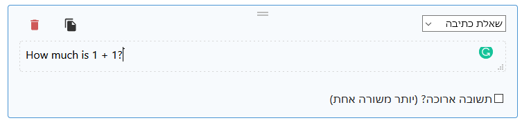
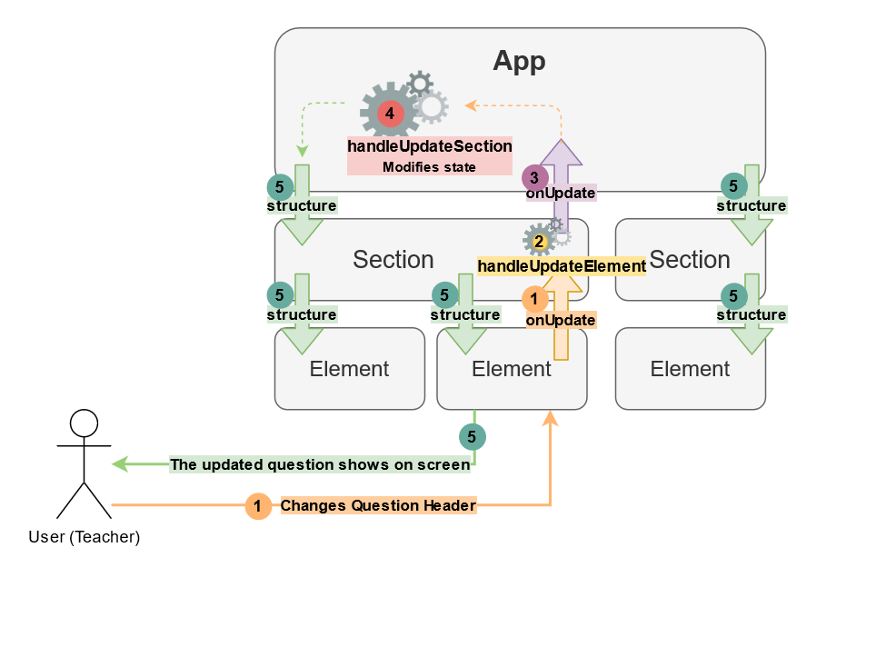

The creator is an activity creation tool, which means that the structure of the activity is a dynamic value, and
it changes over time according to the user's actions.

If in the activity we had the `structure` prop as a static, unchangable entity, here it's the star of the show and it's
what our creator produces at the end of the day.

To recap, we create state in React like this:

```jsx title="App.jsx"
const [structure, setStructure] = React.useState(initialStructure);
```

Where:
* `structure` is how we read the state (The getter): `console.log(structure)`
* `setStructure` is how we modify the state (The setter): `setStructure({ ... })`
* `initialStructure` is just a costant we've defined earlier in the code, and it sets the initial value of the state.

## How the structure is passed down to components

This is very similar to what happens in the activity ([More about it](activity-structure#how-the-structure-is-passed-down-to-sections)).
The activity's structure value is passed down to sub-components, which then pass structure information to their sub-components, and so on.

Example:

```jsx title="App.jsx" {5,9}
function App({ ... }) {
  const [structure, setStructure] = React.useState(initialStructure);
  ...
  return (
    {structure.sections.map((section, index) => (
      <Section
        key={section.id}
        index={index}
        structure={section}
        ...
      />
    ))}
  );
}
```

Then the section treats the given structure as its `structure` prop:

```jsx title="Section.jsx" {1,6,10}
function Section({ structure, ... }) {
  ...

  return (
    ...
    {structure.elements.map((element, i) => (
      <Element
        key={element.id}
        index={i}
        structure={element}
        ...
      />
    ))}
    ...
  );
}
```

Just like passing down structure in the activity, it's important to remember that:


:::note
In every component that has a structure prop (like `App`, `Section`, `GenericElement` and the other element components),
the structure prop resembles the component structure for each component, not the whole activity structure (except for `App` of course).

That means that in `Section`, the structure prop resembles the **section's structure**, and in `Element` the structure prop
resembles the **element's structure**.
:::

## Modifying the Structure State

Like all state, the structure in the creator app needs to be updatable by the user's actions.
These include modifying the main header for example, adding or removing sections or elements, modifying
elements' contents, etc.

:::note
This part is very similar to the activity's `answer` state management ([Link](activity-answering#onanswer-callbacks)),
however it differs in one thing. The `answer` state in the activity is a dictionary, which contains all fillable elements,
regardless of which sections each element belongs to. Here it's different,
because the structure is divided into sections ([here's your reminder about structure](activity-structure#the-structure)),
so instead of just passing down one callback function, every component will have to change the part of the structure that's relevant to it.
We will see it in an example later.
:::

### `onUpdate` & `handleUpdate`

We use callback functions, just like when updating the state in the activity app ([that had `onAnswer` & `handleAnswer`](activity-answering#onanswer-callbacks)).

This is, again, super similar to the [state management in the activity](activity-answering#onanswer-callbacks),
so I recommend reading it first if it hasn't been done already.

When the user changes the contents of an editable field (activity & section headers, element content, question header, etc.),
an event is fired in the changing field, which then calls handling functions.

#### An Example!

Let's take as an example the `text-input` element. Let's write a question in the question header field:



From the source code of this element:

```jsx title="ElementTextInput.jsx"
function ElementTextInput({ structure, ..., onUpdate, ... }) {
  const handleChangeText = (text) => {
    onUpdate(produce(structure, (newStructure) => {
      newStructure.text = text;
    }));
  };
  ...
  return (
    ...
    <Editable onChange={handleChangeText}>{structure.text}</Editable>
    ...
  );
}
```

`Editable` is a custom component, and it's just a text field that looks decent and responds to text change events.

When text is changed, it calls `handleChangeText`, which, with the help of [immer's `produce`](react#mutating-state-with-immer),
creates a structure value with the new text and passes it to the callback function `onUpdate`,
which was supplied by the parent component, `Element`:

```jsx title="Element"
import ElementTextInput from "./ElementTextInput";
function Element({ structure, ..., onUpdate, ... }) {
  const handleUpdate = (updatedElement) => {
    onUpdate(updatedElement);
  };

  return (
    ...
    <ElementTextInput
      structure={structure}
      ...
      onUpdate={handleUpdate}
    />
    ...
  );
}
```

Unlike `onAnswer` in the activity, we don't need to supply the ID of the element requesting the update,
because the element gives its updated structure, which already has an ID.

So `ElementTextInput` has just called its `onUpdate` prop function, which activates the `handleUpdate` fcn in `Element`.
The argument passed from `ElementTextInput`, named `updatedElement`, looks like this:

```jsx
{
  id: '3c0c2653-cc1a-42aa-9caa-1dc0cd38ea12',
  type: 'text-input',
  text: 'How much is 1 + 1?',
}
```

This is the structure which the element wishes to have in the next re-render.

`Element` calls its `onUpdate` prop fcn, which is passed to it by `Section`:

```jsx title="Section.jsx:
function Section({ structure, ..., onUpdate, ... }) {
  const handleUpdateElement = (updatedElement) => {
    onUpdate(produce(structure, (newStructure) => {
      newStructure.elements.forEach((element, i) => {
        if (element.id === updatedElement.id) {
          newStructure.elements[i] = updatedElement;
        }
      });
    }));
  };

  return (
    {structure.elements.map((element, i) => (
      <Element
        key={element.id}
        index={i}
        structure={element}
        ...
        onUpdate={handleUpdateElement}
        ...
      />
    ))}
  );
}
```

The section has just received a call to `handleUpdateElement`, with the argument shown earlier.

It now needs to update that specific element in its structure (which contains multiple elements).
It needs to find the right element to change, by comparing the ID from the received argument with the existing section structure's element list.
When found the element in question, the section simply replaces its structure with the updated structure (`updateElement` argument),
and with Immer's `produce` it creates a new state value to pass up with `onUpdate`.

Finally, the `onUpdate` call from the section is being called at the app, to the function `handleUpdateSection`:

```jsx title="App.jsx"
const handleUpdateSection = (updatedSection) => {
  setStructure(produce(structure, (newStructure) => {
    const i = structure.sections.findIndex(({ id }) => id === updatedSection.id);
    newStructure.sections[i] = updatedSection;
  }));
};
```

Don't forget that `setStructure` is the function to set the structure state.

Like in the section's `handleUpdateElement`, the app finds the section that needs to change its structure, replaces
it, and with `produce` it modifies the main state.

React, after updating any state, will automatically re-render our app, so the new `structure` state will be passed down
to child components.

Here is a graph describing the whole process we've just gone through:



:::note To Recap
When calling the Structure's function `handleChangeElement`,
it doesn't care what changed in the element - it just replaces the element's structure with the new one in its structure,
and then passes the new **section structure** up to the app.

And in the app, same thing: `handleChangeSection` is called in the App component.
The app doesn't care **what** really changed in the section - all it does is replace the old section structure with the new one.

This is how every component makes sure to update their structure, regardless of what changed.
This is how the updates to the structure are passed up until they reach the App component,
where they are then updated in the state and passed down in the new `structure`.
:::
