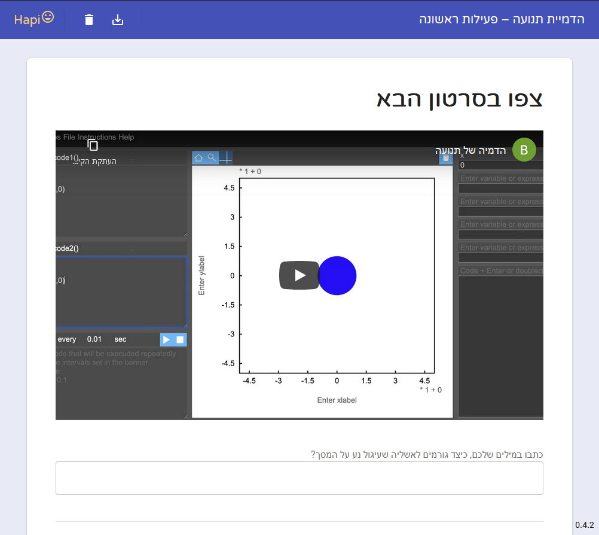
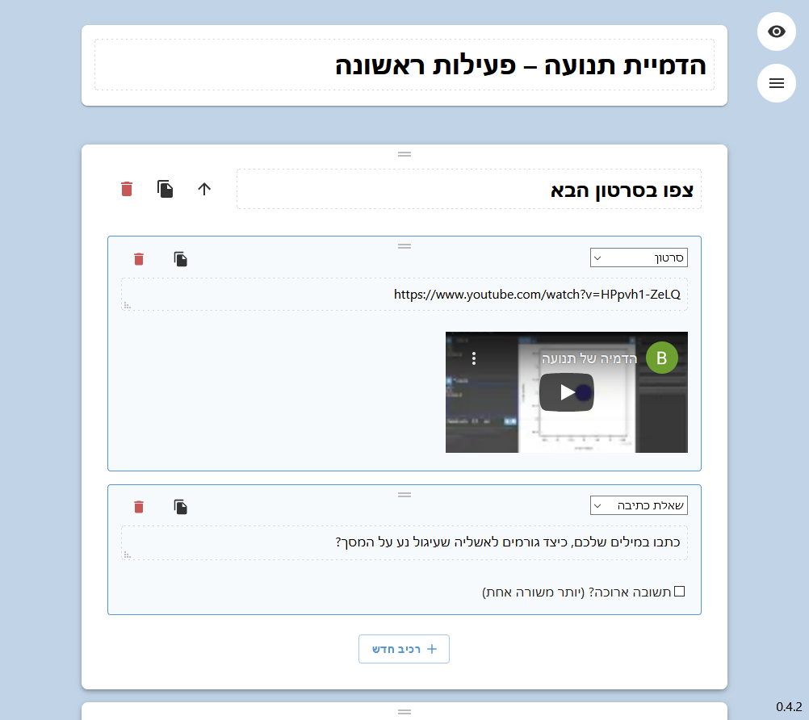

## HAPI = HTML Activity Platform Incubator 😃

Hapi is a small system of browser applications for creating forms named **activities**.
These activities can contain visual elements and questions to fill, some of which can be
automatically checked for a correct answer.

Hapi is mainly intended for creating assignments or exercises for students to do at home.

**Creator live demo: [hapi-creator.netlify.app](https://hapi-creator.netlify.app)**

## Activity

## Creator

