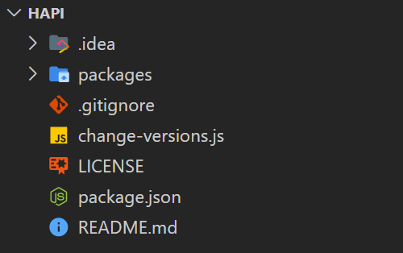
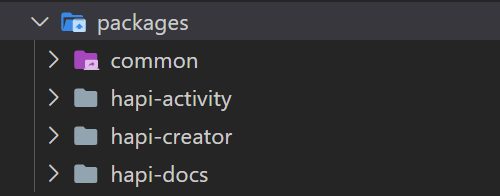
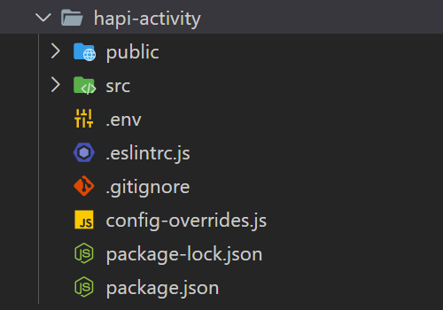
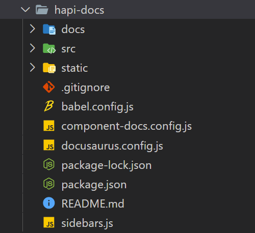

This page provides info about files in the main directories of the project, and where the core packages are located.

import TOCInline from '@theme/TOCInline';

<TOCInline toc={toc} />

## Hapi (Root)

Name | Description
--- | ---
`.idea/` | Files related to JetBrains IDEs, WebStorm in this case. Not very relevant for us.
[`packages/`](#packages) | Contains the 3 packages of this project: `hapi-activity`, `hapi-creator`, and `hapi-docs`
`.gitignore` | Git will ignore every file name or directory written here (and will not upload them to the repository in GitHub).
`change-version.js` | A script that helps change the versions for the root package `hapi`, and the sub-packages `hapi-activity` and `hapi-creator`. For example, use `node change-versions.js 0.4.3`
`LICENSE` | The MIT license of the repository.
`package.json` | [The package manifest, describing it for NPM.](npm)
`README.md` | The readme file, shown in GitHub.

## `packages`

Name | Description
--- | ---
`common` | Shared code that at least 2 packages use.
`hapi-activity` | The [Hapi Activity](activity-index) package. Gets deployed to [hapi-activity.netlify.app](https://hapi-activity.netlify.app)
`hapi-creator` | The [Hapi Creator](creator) package. Gets deployed to [hapi-creator.netlify.app](https://hapi-creator.netlify.app)
`hapi-docs` | The [Hapi Docs](hapi-docs) package (this website). Gets deployed to [hapi-docs.netlify.app](https://hapi-docs.netlify.app)

## `hapi-activity` & `hapi-creator`

<!-- Todo: Fill in CRA link -->

Both `hapi-activity` and `hapi-creator` were generated using [Create React App](https://create-react-app.dev/),
a package developed by Facebook that helps create React apps, along with a convenient setup for development.

As they both have rather similar folder structures, we'll take a look at only one of them:

Name | Description
--- | ---
`public/` | Static assets and other files that should appear in the top level directory of the site. For example, `public/favicon.ico` will appear on `example.com/favicon.ico` when the package is deployed. This is also the place for the `index.html` template.
`src/` | The place of residence of the entire JavaScript & React code in the package. The source code, if you will.
`.env` | An optional file with environment variables with settings for the React bundler or with custom settings to the app.
`.eslintrc.js` | An optional file to configure [ESLint](https://eslint.org/), an aid package that helps enforce consistent code style and identify possible errors in the code before running it.
`.gitignore` | Git will ignore every file name or directory written here (and will not upload them to the repository in GitHub). Automatically generated by Create React App.
`config-overrides.js` | A custom config override for the react bundler (react-scripts). Provides the ability to use code from the `common` directory (which otherwise would be blocked by react-scripts). Also it enables us to build the activity into just a single html file, containing all the source code inside it (with [html-webpack-inline-source-plugin](https://www.npmjs.com/package/html-webpack-inline-source-plugin))
[`package-lock.json`](npm#package-lockjson) |
[`package.json`](npm) |

## `hapi-docs`

This package was initiated using [Docusaurus](https://v2.docusaurus.io/), a package for creating and maintaining documentation websites.

Name | Description
--- | ---
`docs/` | All of these documentation pages you see under `hapi-docs.netlify.app/docs/*`. Also contains the images that appear in the docs, under `docs/assets/`.
`src/` | Custom components and pages (like the custom visual components for [Activity Components](../components/activity) and [Creator Components](../components/creator)).
`static/` | Static assets like `favicon.ico` and other global banners and images for the site.
`.gitignore` | Git will ignore every file name or directory written here (and will not upload them to the repository in GitHub). Automatically generated by Docusaurus.
`babel.config.js` | Configuration for [Babel](https://babeljs.io/), the JS preprocessor that supports JSX. Generated by Docusaurus and not very relevant to us.
`component-docs.config.js` | A custom file, not created by Docusaurus. Includes several settings to configure the [component documentation pages](../components/activity).
`docusaurus.config.js` | The Docusaurus configuration file, for changing many aspects of the site, from themes, plugins, functionalities, and menus.
[`package-lock.json`](npm#package-lockjson) |
[`package.json`](npm) |
`README.md` |
`sidebars.js` | A Docusaurus configuration file for the sidebar you see on your left.
