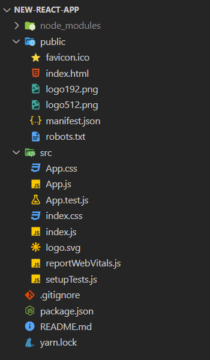
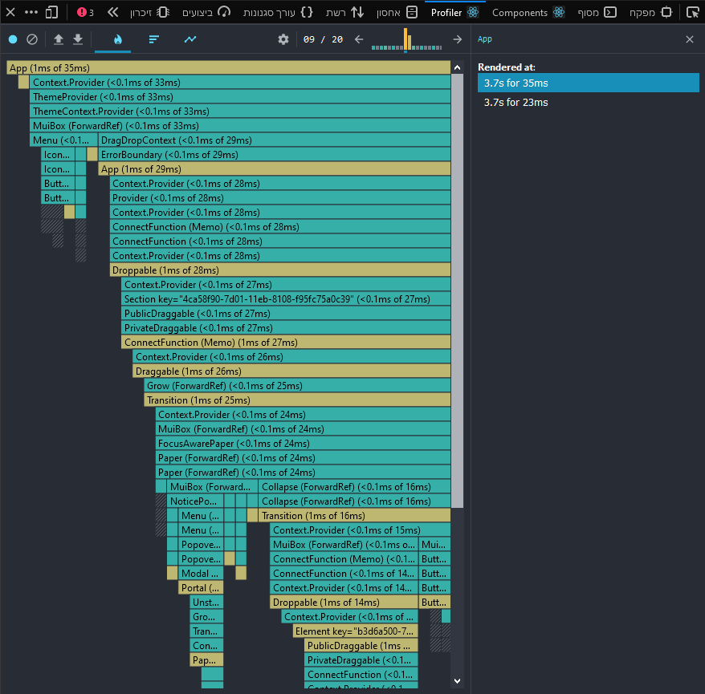

The following video explains the basic concepts of React, please watch it:

<iframe
  width={600}
  height={600 * 9/16}
  src="https://www.youtube.com/embed/Tn6-PIqc4UM"
  frameBorder={0}
  allow="accelerometer; autoplay; clipboard-write; encrypted-media; gyroscope; picture-in-picture"
  allowFullScreen
/>

<br />
<br />

The following official guide is an excellent source of learning React from scratch:
[https://reactjs.org/docs/hello-world.html](https://reactjs.org/docs/hello-world.html)

After reading this page or the official guide, I would strongly recommend making a small project
([Tic Tac Toe](https://reactjs.org/tutorial/tutorial.html)) in React before continuing to the next pages.
This helps build a feeling for React rendering and its state.

## Index

import TOCInline from '@theme/TOCInline';

<TOCInline toc={toc.slice(1)} />

## Hello World Example

The easiest way to set up React would be to put it in a script tag inside an HTML file:

```html {11-14}
<body>
    <!-- This is where React will render its components to DOM. -->
    <div id="root"></div>

    <!-- Importing React -->
    <script src="https://unpkg.com/react@17/umd/react.development.js" crossorigin></script>
    <script src="https://unpkg.com/react-dom@17/umd/react-dom.development.js" crossorigin></script>

    <!-- Our React code -->
    <script>
        ReactDOM.render(
          React.createElement('h1', null, 'Hello World'),
          document.getElementById('root')
        );
    </script>
</body>
```

import BrowserWindow from '../src/components/BrowserWindow';

<BrowserWindow>
  <h1>Hello World</h1>
</BrowserWindow>

The `ReactDOM.render` function accepts two arguments:
1. What to render
2. Where to render

This way of building a full-blown production web app is not very good, because splitting into multiple
files is not very easy, and JSX isn't supported.

### What is JSX?

**JSX is an intuitive syntax for creating React components in an HTML style.**

As you could see, we were writing pure JS:

```js {2}
ReactDOM.render(
  React.createElement('h1', null, 'Hello World'),
  document.getElementById('root')
);
```

instead of using JSX:

```jsx {2}
ReactDOM.render(
  <h1>Hello World</h1>,
  document.getElementById('root')
);
```

which looks a lot more elegant.
These two versions are equivalent. The first is with pure JavaScript, and the second is using JSX.

To use JSX, which is not supported by browsers, we will have to use preprocessors and bundlers,
which `react-scripts` gives us (it comes with [Create React App](#create-react-app)).
A preprocessor simply translates complex JavaScript ([ES6+](https://www.w3schools.com/js/js_es6.asp)),
which is not always supported in browsers, to regular JavaScript.
And that includes also converting JSX tags to `React.createElement`.

The whole HAPI project is written this way with `react-scripts` & JSX,
so for the rest of the explanations we will use the JSX syntax.

## React Components

Components are reusable parts of the UI (user interface).

A component can render HTML tags or render other components.

In react there are two ways to create components, with a class or with a function.
Creating components using a function is a newer and preferred way, and it's used in the Hapi project,
so we will only cover this way of creating React components in these docs.

Let's take as an example the following components:

```jsx
function App() {
  return (
    <div style={{ display: 'flex' }}>
      <Logo />
      <Title />
    </div>
  );
}

function Logo() {
  return ;
}

function Title() {
  return <h1>Hello React</h1>;
}

ReactDOM.render(
  <App />,
  document.getElementById('root')
)
```

<BrowserWindow>
  <div style={{ display: 'flex' }}>
    
    <h1>Hello React</h1>
  </div>
</BrowserWindow>

The usage of components here lets us divide implementations of different areas in our UI,
and make less bloated code when these components grow as we develop them.

It's important to notice that when React renders components, all it does is replace the component tag with what it renders.

When React sees that we want to render, for example:

```jsx
<div id="logo-container">
  <Logo />
</div>
```

it *literally* replaces the `Logo` tag with what the `Logo` component renders, so we end up with:

```jsx {2}
<div id="logo-container">
  
</div>
```

React does this for every component until it's only left with HTML tags.

### Component Props

React props lets us define different characteristics for a component, similarly to HTML attributes:

```jsx
function App() {
  return (
    <>
      <Logo type="react" />
      <br />
      <Logo type="nike" />
      <br />
      <Logo type="hapi" />
    </>
  );
}

function Logo(props) {

  if (props.type === 'react') {
    return ;
  }

  else if (props.type === 'hapi') {
    return ;
  }

  else {
    return <span>Unknown logo!</span>;
  }

}
```

Then when we render `App`:

<BrowserWindow>
  
  <br />
  <span>Unknown logo!</span>
  <br />
  
</BrowserWindow>

Whenever an attribute is passed to a component like this:

```jsx
<Component prop1="abc" prop2={1234} />
```

Its first argument, which we tend to call "props", will be:

```json
{
  "prop1": "abc",
  "prop2": 1234
}
```

so we can use different settings when we initiate our component anywhere.

In the example above, we have defined the `Logo` component to render an image based on the type of logo we wanted it to be.
As you can see, the "Nike" type isn't stated in one of the `if` conditions, so it's thrown to the `else` clause
and renders the default element we've told it to render.

### The `children` prop

It's possible to assign children to components, similarly to HTML.

When we put child elements inside a React component, they will be automatically provided in `props.children`.

```jsx {4,14}
function App() {
  return (
    <Article title="My new article">
      <p>Text, text and more text</p>
    </Article>
  );
}

function Article(props) {
  return (
    <>
      <h1>{props.title}</h1>
      <div>
        {props.children}
      </div>
    </>
  );
}
```

All `Article` does is add a title (in correspondance to the `title` prop) and wrap its children with a `<div>`.

Look how we wrapped the `<p>` element with `<Article>`.
Everything inside `<Article>` will be stored in `props.children`.

And the result (when we render `App`):

<BrowserWindow>
  <h1>My new article</h1>
  <div>
    <p>Text, text and more text</p>
  </div>
</BrowserWindow>

### Component State (with `useState`)

State is a dynamic piece of information that can be changed in our application.
Without state, our React app would be static and users couldn't interact with it.

Let's consider the following example (which is also seen in the video above):

```jsx
function App() {
  const [count, setCount] = React.useState(0);

  return (
    <>
      <p>
        You have clicked {count} times.
      </p>
      <button onClick={() => { setCount(count + 1) }}>
        Click
      </button>
    </>
  );
}
```

import StateExample from '../src/components/StateExample';

<BrowserWindow>
  <StateExample />
</BrowserWindow>

`React.useState` is a React function which gives us an array of two things:

1. The state variable (**To read the state**)
2. The state set function (**To write/change the state**)

So we just [destruct](https://developer.mozilla.org/en-US/docs/Web/JavaScript/Reference/Operators/Destructuring_assignment)
this array and define these `count` and `setCount` entities.

The `0` we placed in `useState` is simply the value to start with. In this case we wanted to start counting from zero.

Every time the button is clicked, the `setCount` function is called with the value `count + 1`, thus increasing this
state's value by one. Basic stuff.

To display the count inside the `<p>` tags we do `{count}`. These curly braces tell JSX to interpret it as JavaScript code
instead of just plain text.

:::tip
`count` is just a normal JavaScript variable, so you can go ahead and pass it to other components as their props.
This is how React apps are built:
Components manage state and pass the state to sub-components, which pass things to more sub-sub-components...
You got the idea.
:::

How does react know to change this `{count}` part of the component?
When we call the `setCount` function that React gave us, React will re-render the component in addition to updating the state.
When re-rendering components, React compares the state before the re-render and after the re-render, and only changes
the HTML of parts that have changed.
That way, when React re-renders huge components, only the different parts change in the HTML.
More about this process [here](https://reactjs.org/docs/reconciliation.html).

### Mutating State with Immer

Sometimes in React we will have state variables of mutable types, such as arrays and objects.

Let's consider, for example, a state variable for a theme chooser:

```jsx
const initialTheme = { primaryColor: 'blue', backgroundColor: 'white' };
const [theme, setTheme] = React.useState(initialTheme);
```

Now, let's say that the user has pressed a button to change the theme.

How would we change the theme's `primaryColor`, for example?

We can forcefully mutate the state, but that will cause hard-to-detect bugs, and React might throw weird errors.

```jsx {2}
const handleChangeTheme = () => {
  theme.primaryColor = 'orange';
  setTheme(theme);
};
```

:::caution Don't do this!
Seriously, don't do this. Use copying or Immer instead.

[Why Not To Modify React State Directly - daveceddia.com](https://daveceddia.com/why-not-modify-react-state-directly/)

[Mutate array of objects in react - stackoverflow.com](https://stackoverflow.com/questions/53006323/mutate-array-of-objects-in-react)
:::

**The solution: Copying the state object, mutating it, and then updating it using the copy.**

```jsx
const handleChangeTheme = () => {
  const themeCopy = { ...theme };
  themeCopy.primaryColor = 'orange';
  setTheme(themeCopy);
};
```

That way, changing `themeCopy` won't change `theme`.

**A more elegant solution would be to use [`immer`](https://immerjs.github.io/immer/docs/introduction)**,
which can update large data trees efficiently, without the need to copy the whole object.

```jsx
import produce from 'immer';

const handleChangeTheme = () => {
  setTheme(produce(theme, (newTheme) => {
    newTheme.primaryColor = 'orange';
  }));
};
```

Immer gives us `newTheme` to play with.
When we're done, it compares the changes and returns us a new state to put inside `setTheme`.

:::info
This is how state is managed in `hapi-activity` and in `hapi-creator`.
:::

## Create React App

[`create-react-app`](https://create-react-app.dev/) is a helpful package developed by Facebook,
and it creates a new React project with the basic, needed files,
as well as `react-scripts` which preprocesses JSX code and creates a convenient development environment.

Try the following steps by yourself to get more comfortable in creating React apps.

To initialize a new React project, simply run the following command
(and make sure to rename `your-app-name` to a name you want for your app):

```bash
npx create-react-app your-app-name
```

No need to install `create-react-app` in the first place. `npx` will find the latest version online and run it.

You will now see that a new folder has been created with the name of your React app
(in this case it's named `your-app-name`).
Let's take a look on the contents of this folder:



Looks a little intimidating.

These files are provided as part of the [Create React App default template](https://create-react-app.dev/docs/folder-structure).
As you can see this structure is very similar to the structures of `hapi-activity` and `hapi-creator`.

The three most important files here are:

File name | Description
--- | ---
`package.json` | Defines this React app package. ([More info](npm#initializing-a-package))
`src/index.js` | This is the entry point for your app. This is what actually runs when `react-scripts` is bundling your app. Here is where you would want to import your `App` component and render it.
`public/index.html` | This is the HTML template onto which all the processed code will be added. If you were to look at it, you would see the `<div id="root">`.

These are the three files that hold your package together. If you were to remove any one of them, your project would
not build or bundle. You can basically delete any other file in `src/` and in `public/` to clean the project before starting.

The `src/` directory is for your JavaScript source code, and the `public/` directory is for static files like images
and other assets that are put in the root folder of the build (Head over to [Project Files & Folders](project-files-folders#hapi-activity--hapi-creator) for more explanation.)

After running the `npx create-react-app` command, it will show you how to run and build your app.
Check the [Usage](usage) page for more info about that
(the commands shown there will work even if your project is using `yarn`).

## React Developer Tools

React Developer Tools is a browser extension that greatly helps analyze React apps.

Download:
[Chrome](https://chrome.google.com/webstore/detail/react-developer-tools/fmkadmapgofadopljbjfkapdkoienihi?hl=en)
/ [Firefox](https://addons.mozilla.org/en-US/firefox/addon/react-devtools/)

Its features include:

### Component inspection

Just like HTML "Inspect element" that exists in most browsers (right click on anything and choose "Inspect element"),
React Devtools provides a feature to inspect React elements and how they are organized.
You can see each React component and its props and states, and the HTML that it produces.

Using this feature is a great way to explore React apps and how they are built, and it's recommended that you use it.


### Profiler

The profiler shows us which components take the most time to render and in what time every component renders.
This is helpful for spotting problems while making performance optimizations, and it's less relevant for these docs.


